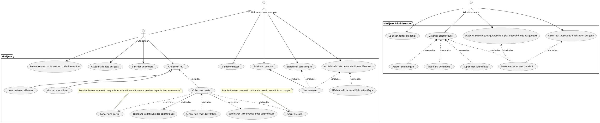

```plantuml

@startuml
:Utilisateur: as u
:Utilisateur avec compte: as uc
:Administrateur: as admin

uc <|-- u
package Mini-jeux{

    u --> (Rejoindre une partie avec un code d'invitation)
    u --> (Accéder à la liste des jeux)
    u --> (Se créer un compte)
    u --> (Choisir un jeu)
    (Choisir un jeu) <|-- (chosir de façon aléatoire)
    (Choisir un jeu) <|-- (choisir dans la liste)


    (Choisir un jeu) <.. (Créer une partie) : <<include>>
    (Créer une partie) <.. (générer un code d'invitation) : <<include>>
    (Créer une partie) ..> (configurer la thématique des scientifiques) : <<extends>>
    (Créer une partie) ..> (configure la difficulté des scientifiques) : <<extends>>
    (Créer une partie) ..> (Lancer une partie) : <<extends>>
    (Créer une partie) ..> (Saisir pseudo) : <<extends>>

    note "Pour l'utilisateur connecté : utilisera le pseudo associé à son compte" as notePseudo
    note "Pour l'utilisateur connecté : on garde les scientifiques découverts pendant la partie dans son compte" as noteUC
    noteUC .. (Lancer une partie)
    notePseudo .. (Saisir pseudo)

    uc --> (Se déconnecter)
    (Saisir son pseudo) <.. (Se connecter) : <<include>>
    uc --> (Saisir son pseudo)
    (Supprimer son compte) <.. (Se connecter) : <<include>>
    uc --> (Supprimer son compte)
    (Accéder à la liste des scientifiques découverts) <.. (Se connecter) : <<include>>
    uc --> (Accéder à la liste des scientifiques découverts)
    (Accéder à la liste des scientifiques découverts) <.. (Afficher la fiche détaillé du scientifique) : <<extends>>
}

package "Mini-jeux Administration"{
    admin --> (Se déconnecter du panel)
    admin --> (Lister les scientifiques)
    (Lister les scientifiques) <.. (Se connecter en tant qu'admin) : <<include>>
    (Lister les scientifiques) <.. (Ajouter Scientifique): <<extends>>
    (Lister les scientifiques) <.. (Modifier Scientifique): <<extends>>
    (Lister les scientifiques) <.. (Supprimer Scientifique): <<extends>>
    admin --> (Lister les scientifiques qui posent le plus de problèmes aux joueurs)
    (Lister les scientifiques qui posent le plus de problèmes aux joueurs) <.. (Se connecter en tant qu'admin) : <<include>>

    admin --> (Lister les statistiques d'utilisation des jeux)
       (Lister les statistiques d'utilisation des jeux) <.. (Se connecter en tant qu'admin) : <<include>>
}


@enduml

```