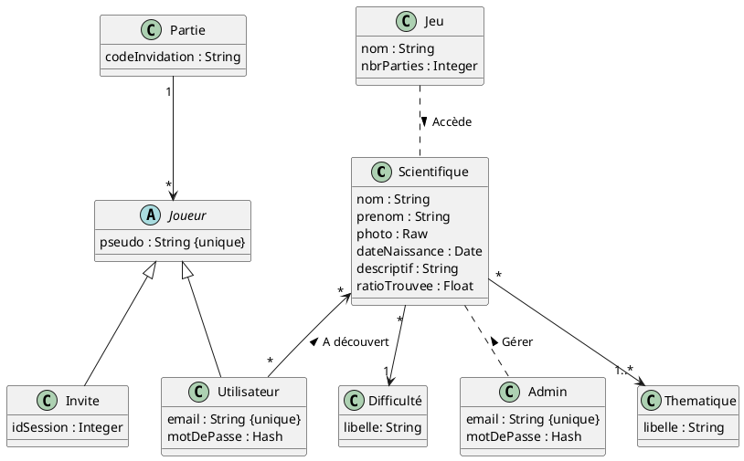

```plantuml 

@startuml "BDD"

class Scientifique{
    nom : String
    prenom : String
    photo : Raw
    dateNaissance : Date
    descriptif : String
    ratioTrouvee : Float
}

class Thematique{
    libelle : String
}

class "Difficulté"{
    libelle: String
}

Scientifique "*" --> "1..*" Thematique
Scientifique "*" --> "1" "Difficulté"
Scientifique "*" <-- "*"Utilisateur : A découvert <
Scientifique .. Admin : Gérer <


abstract Joueur{
    pseudo : String {unique}
}

class Utilisateur{
    email : String {unique}
    motDePasse : Hash
}

class Invite{
    idSession : Integer
}

Joueur <|-- Utilisateur
Joueur <|-- Invite

class Admin{
    email : String {unique}
    motDePasse : Hash
}


class Jeu{
    nom : String
    nbrParties : Integer
}

Jeu .. Scientifique  : Accède >

class Partie{
    codeInvidation : String
}

Partie "1" --> "*" Joueur

@enduml
```